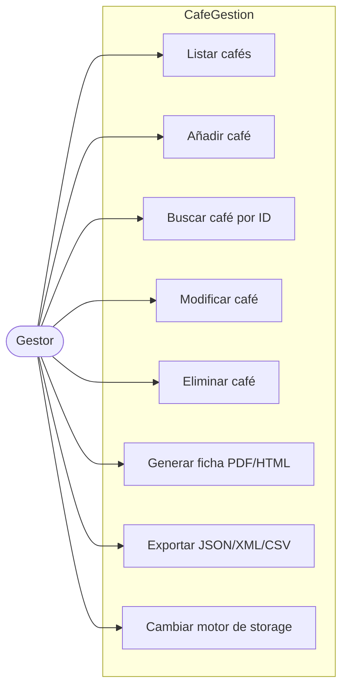
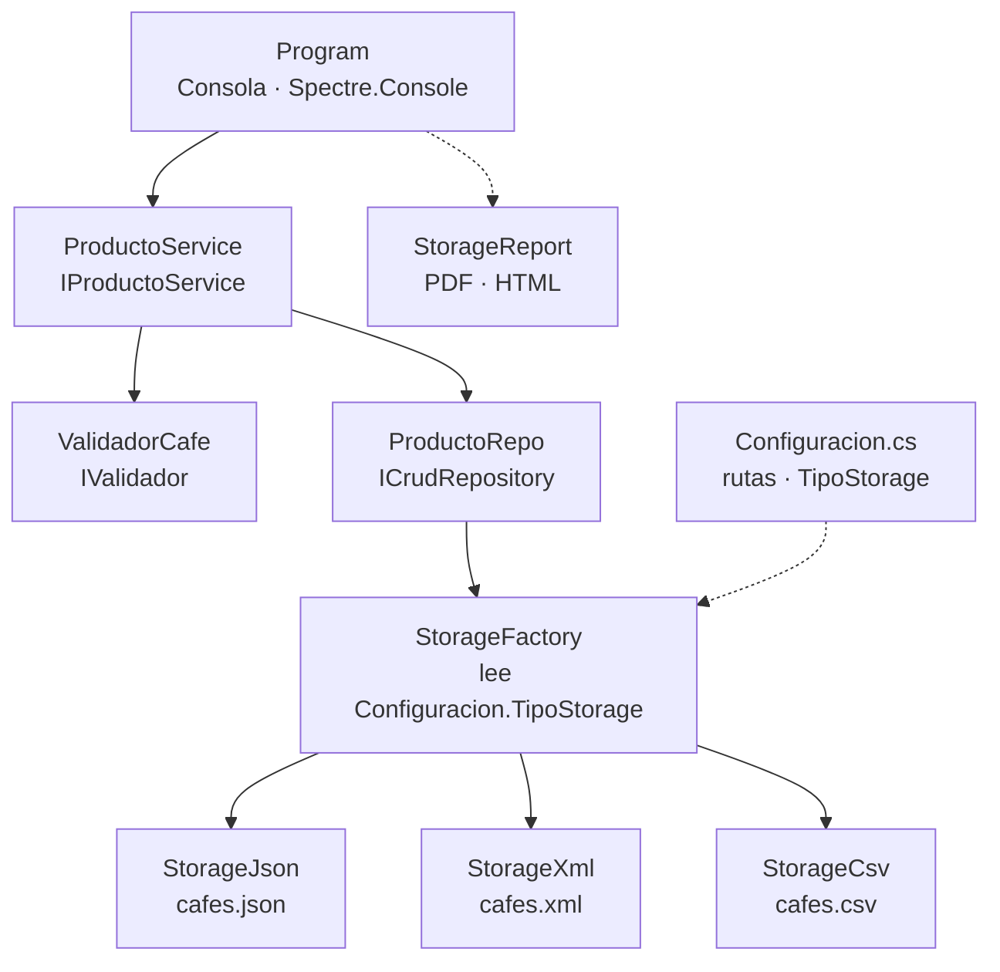
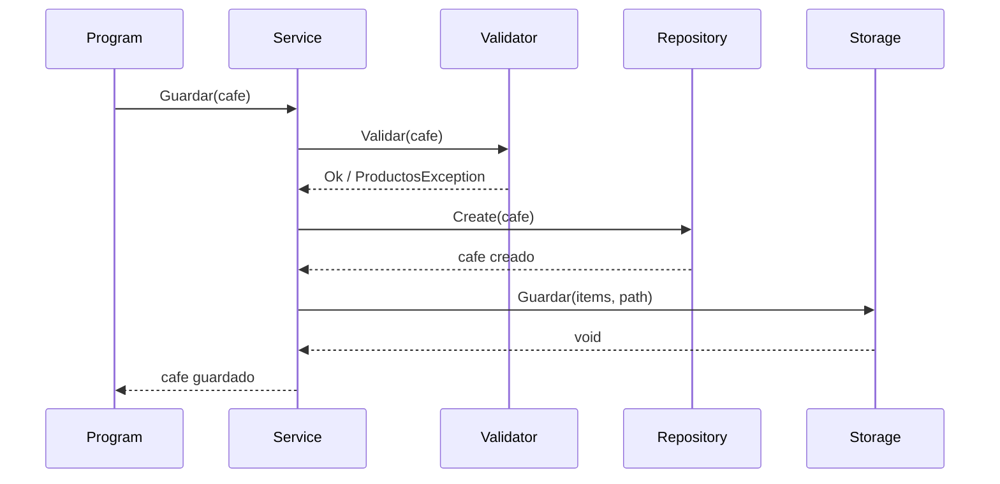
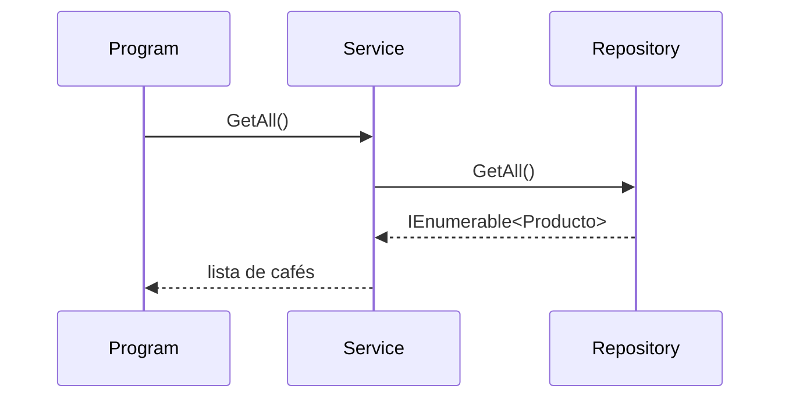
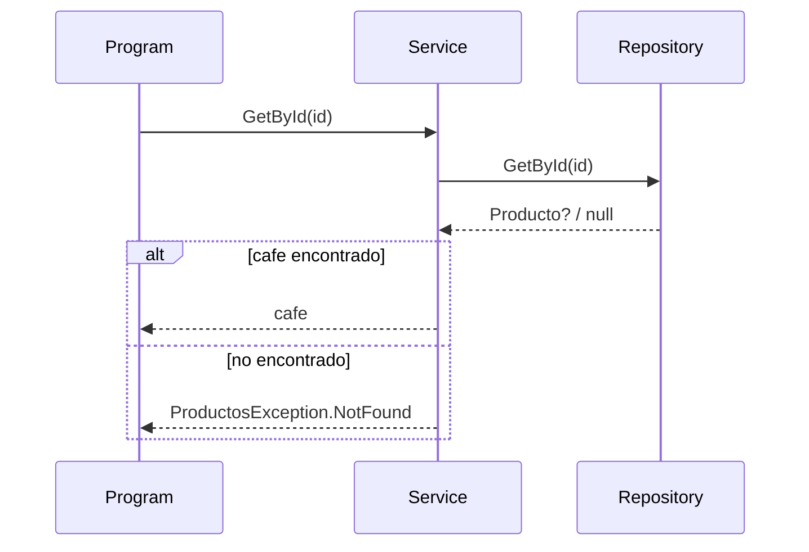
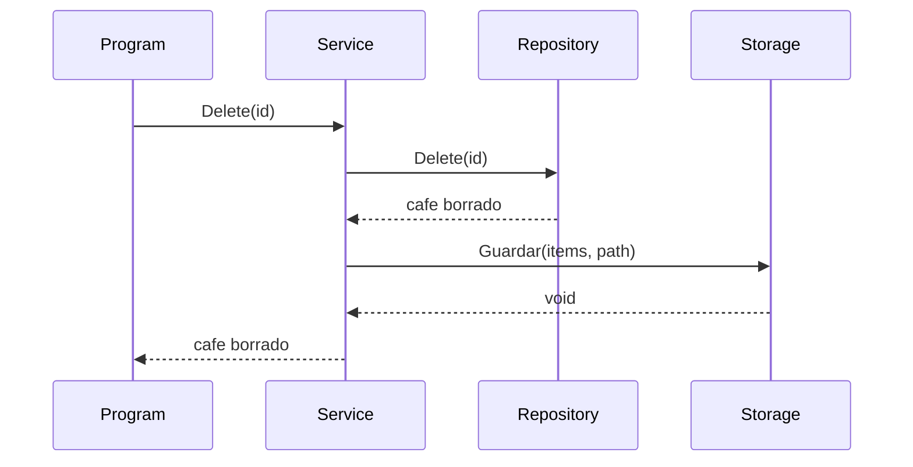
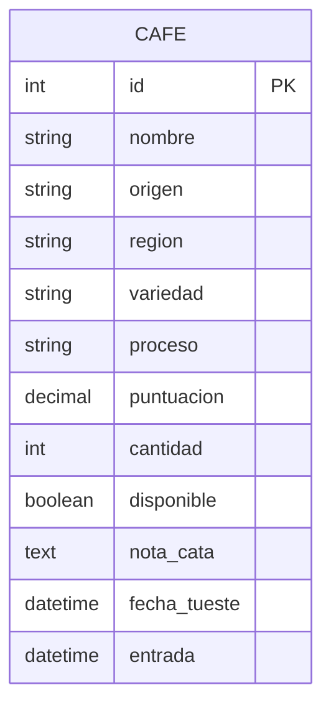

## Diagrama de Casos de Uso

---

## Diagrama de Arquitectura

---

## Diagrama de Secuencia — Guardar

---

## Diagrama de Secuencia — GetAll

---

## Diagrama de Secuencia — GetById

---

## Diagrama de Secuencia — Delete

---

## Diseño de Base de Datos

